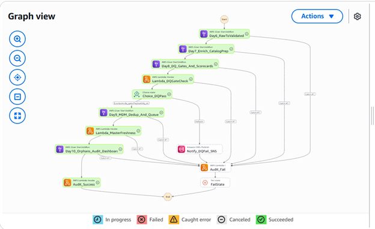
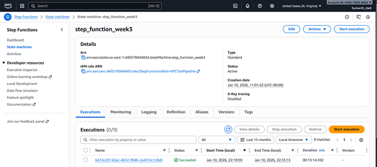

# Week 3 — Orchestration, Transformation & Data Warehousing Foundations (Governance-First)

**Dataset:** NYC Yellow Taxi Trips  
**Platform:** AWS S3 + AWS Glue (Spark) + Step Functions + CloudWatch + (optional) RDS/Redshift  
**Goal:** Build production-style orchestration with governance gates, implement SQL transformations with tests, and implement SCD Type 2 + master data versioning.

---

## What I Learned (Week 3 Summary)

### 1) Orchestration & Monitoring (Day 11)
- Designed an end-to-end pipeline using **AWS Step Functions** to orchestrate Glue jobs (validated → curated → master).
- Added governance checkpoints:
  - **Data Quality Gate:** fail pipeline if pass rate drops below threshold.
  - **Master Data Freshness Check:** warn if reference/master data is stale.
  - **Audit Trail Logging:** captured who/what/when + paths processed + results of quality checks.
- Implemented operational monitoring:
  - CloudWatch logs for every step
  - alarms for failures/retries
  - run history and traceability

**Outcome:** A repeatable pipeline run produces curated/master outputs with traceable quality + lineage.
### Day 11 — Orchestration & Monitoring 
### Glue / Spark jobs used as pipeline steps
- Day 6 (raw → validated Delta): [`glue_jobs/day6_datalake_delta_raw_to_validated_glue.py`](step_function/day6_datalake_delta_raw_to_validated_glue.py)
- Day 7 (validated → curated enrichment): [`glue_jobs/day7_spark_enrich_and_catalog_prep.py`](step_function/day7_spark_enrich_and_catalog_prep.py)
- Day 8 (quality gates + quarantine + report): [`glue_jobs/day8_glue_quality_gates_validated_to_curated.py`](step_function/day8_glue_quality_gates_validated_to_curated.py)
- Day 9 (MDM matching/dedup + steward queue): [`glue_jobs/day9_mdm_matching_dedup_engine.py`](step_function/day9_mdm_matching_dedup_engine.py)
- Day 10 (lifecycle + audit + orphan detection): [`glue_jobs/day10_mdm_lifecycle_audit_orphans.py`](step_function/day10_mdm_lifecycle_audit_orphans.py)

> Note: Week 3 orchestration (Day 11) calls these jobs in sequence with pass/fail governance gates.

--- 

### Orchestration (Step Functions)
- State machine graph: 
- Successful execution: 
### Triggers (EventBridge)
- Schedule / S3 trigger rule: 

### Processing (Glue)
- Glue job runs: 

### Outputs (S3)
- Curated output: 
- Orphans quarantine: 
- Audit outputs: 
### Audit Table (Dynamodb)
-Audit Table: 
### Notifications (SNS)
- SNS topic/subscription: 
---
---

---

## Advanced SQL Transformations + Governance as Code (Day 12–13)

### What Was Implemented

- Built **modular SQL transformations** using:
  - Common Table Expressions (CTEs) for readability and reuse
  - Clear separation of layers: staging → dimension
- Implemented **SQL-based data quality checks**:
  - Not-null validations
  - Business key uniqueness
  - Referential integrity against master zone dimension
- Added **governance metadata in SQL headers**:
  - Author
  - Owner
  - Purpose
  - Dependencies
  - Quality expectations
- Designed SQL scripts to be **scheduler-ready** for Glue execution

### Outcome

SQL logic is:
- Version-controlled
- Testable
- Auditable
- Production-ready

---

## Slowly Changing Dimensions (SCD Type 2) + Master Data Versioning (Day 14–15)

### What Was Implemented

- Designed and implemented **SCD Type 2 dimension** for taxi zones:
  - Surrogate key
  - `effective_from` / `effective_to`
  - `is_current`
  - `version_number`
- Used **hash-based change detection** to identify attribute changes
- Implemented **audit logging** for:
  - Insert
  - Expire
  - No-change events
- Enabled **point-in-time queries** for historical accuracy
- Defined rollback capability using versioned records

### Outcome

Historical truth is preserved for:
- Analytics
- Auditing
- Compliance
- Dispute resolution
   - 
---

## Dataset Mapping to SQL Logic

### TLC Fields Used

From Yellow Taxi schema:
- `tpep_pickup_datetime`
- `tpep_dropoff_datetime`
- `PULocationID`
- `DOLocationID`
- `fare_amount`
- `total_amount`
- `tip_amount`

### How They Are Used

- Pickup/dropoff timestamps → duration & sanity checks
- Amount fields → non-negative validation rules
- Location IDs → referential integrity to master zone dimension

---

## SQL Structure (Transformations, Quality, SCD2)

### Transformations
- Stage zones: [`Sql_with_scd2/sql/10_transforms/100_zone_dim.sql`](Sql_with_scd2/sql/10_transforms/100_zone_dim.sql)

### Data Quality
- Required fields: [`Sql_with_scd2/sql/20_quality/200_dq_zone_master.sql`](Sql_with_scd2/sql/20_quality/200_dq_zone_master.sql)
- Assertion gate:  
  `Sql_with_scd2/sql/20_quality/299_dq_assertions.sql`

### SCD Type 2 Logic
- Apply SCD2 changes: [`Sql_with_scd2/sql/30_procedures/300_apply_zone_scd2.sql`](Sql_with_scd2/sql/30_procedures/300_apply_zone_scd2.sql)
- Approve version: [`Sql_with_scd2/sql/30_procedures/310_approve_version.sql`](Sql_with_scd2/sql/30_procedures/310_approve_version.sql)
- Rollback version: [`Sql_with_scd2/sql/30_procedures/320_rollback_version.sql`](Sql_with_scd2/sql/30_procedures/320_rollback_version.sql)
- Audit history: [`Sql_with_scd2/sql/30_procedures/330_audit_version_history.sql`](Sql_with_scd2/sql/30_procedures/330_audit_version_history.sql)
---

## Governance & Audit Tables

### Key Tables

- `governance.pipeline_run_audit`
- `governance.zone_change_audit`
- `governance.dq_results`
- `governance.mdm_version_control`

These tables provide:
- Full lineage
- Run-level traceability
- Data quality transparency
- Stewardship approval tracking

**SQL script headers**
/* ------------------------------------------------------------
Author: Sumanth
Owner: Data Engineering
Purpose: Candidate dataset for SCD2 apply (with stable hashdiff)
Dependencies: staging.stg_zone_master_incoming, pgcrypto extension
------------------------------------------------------------ */

**Data quality SQL results**
   - Pass/fail counts for validation rules  

---

### Day 14–15 — SCD Type 2 + Versioning (Must-have)

9. **SCD2 dimension table schema**
   - `effective_from`, `effective_to`, `is_current`, surrogate key  
    

10. **SCD2 history example**
    - Same `location_id` with multiple versions  
    

12. **Rollback / version history**
    - Evidence of reverting to a prior version  
    - 

---

## Key Learnings

- SQL can be treated as **governance-as-code**
- SCD Type 2 is essential for historical accuracy
- Data quality gates must precede dimension updates
- Audit tables are first-class citizens in enterprise pipelines

---

